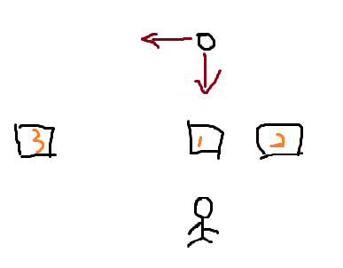

# 9.掉落系统

对于一款割草游戏，掉落系统是必不可少的。

我们来简单梳理一下掉落系统的基本逻辑。

1. 首先击杀敌人。敌人掉落物品

<figure><figcaption></figcaption></figure>

2. 拾取物品（可以看到靠近后出现了F键的提示）

<figure><figcaption></figcaption></figure>

<figure><figcaption>
这里修改了掉宝率，100%掉落四词条的红色物品
</figcaption></figure>

消耗品背包中也出现了掉落的消耗品

<figure><figcaption></figcaption></figure>

掉落概率与写在敌人的配置表里，又和自身掉宝率相关。

